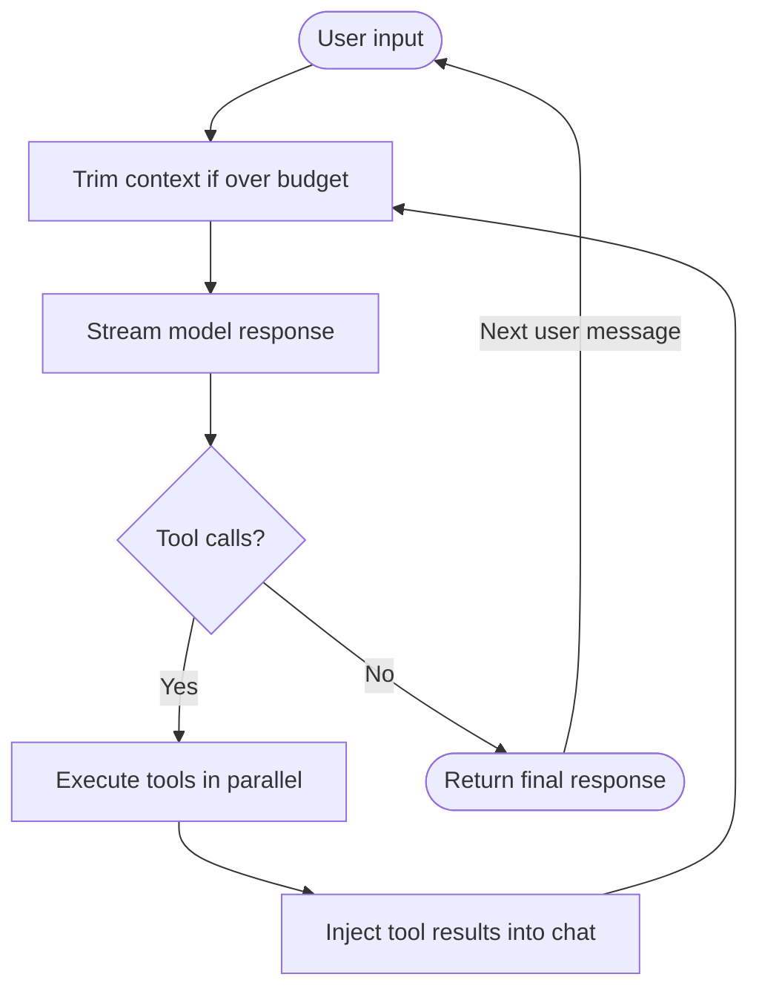

# Agent Forge

> **Status: prototype / experimental** — exploring agentic patterns, not for production use.

Multi-turn LLM agent with streaming tool use, atomic context management, and gRPC RAG integration.

Designed to pair with/explore [go-to-rag](https://github.com/DanielBlei/go-to-rag), a Go RAG engine that exposes
retrieval and generation over gRPC. agent-forge calls it as a first-class tool during conversation.

## Purpose

Hands-on exploration of how agentic systems work at the implementation level:

- How multi-turn conversation state fills a context window and must be trimmed without corrupting tool-call sequences
- How models at different scales decide when to call a tool, which one to pick, and how to interpret the result
- How streaming, retries, and context errors compose in a real async loop
- How local models behave in an agentic context — and where smaller ones break down

The loop, context management, and tool dispatch are all explicit and readable. Deliberately built without
LangChain or LangGraph — the intent is to understand the mechanics before adopting a framework that abstracts them away.

## Benchmarks

A core question this project explores: **does tool-use comprehension scale with parameter count?** Can a small model decide *when* a tool is needed, pick the right one, and correctly interpret the result — or does that only emerge at larger scale?

The benchmark is a diagnostic baseline, not a destination. The goal is a feedback loop: identify where models fail, intervene (prompt engineering, fine-tuning, distillation), re-run, and compare. The category breakdown in each result file points at the specific failure modes worth targeting.

11 behavioral evals ask a live model questions about this codebase, each with a ground-truth answer verifiable from the repo. Two pass conditions per question: the model must call a tool (no hallucinating without evidence) and the response must contain the expected string(s).

_Run on Ollama, NVIDIA RTX 4070 Super, Fedora Linux 43. See [tests/README.md](tests/README.md) for full methodology._

<table>
  <thead>
    <tr>
      <th>Model</th>
      <th align="center">Pass rate</th>
      <th align="center">Tool call rate</th>
      <th align="center">chat</th>
      <th align="center">config</th>
      <th align="center">grep</th>
      <th align="center">loop</th>
      <th align="center">project</th>
      <th align="center">tools</th>
    </tr>
  </thead>
  <tbody>
    <tr>
      <td><code>qwen3:0.6b</code></td>
      <td align="center">9.1%</td>
      <td align="center">27.3%</td>
      <td align="center">0/2</td>
      <td align="center">0/2</td>
      <td align="center">0/2</td>
      <td align="center">0/2</td>
      <td align="center">0/1</td>
      <td align="center">1/2</td>
    </tr>
    <tr>
      <td><code>qwen3:4b</code></td>
      <td align="center">72.7%</td>
      <td align="center">90.9%</td>
      <td align="center">1/2</td>
      <td align="center">2/2</td>
      <td align="center">2/2</td>
      <td align="center">1/2</td>
      <td align="center">0/1</td>
      <td align="center">2/2</td>
    </tr>
    <tr>
      <td><code>qwen3:8b</code></td>
      <td align="center">90.9%</td>
      <td align="center">90.9%</td>
      <td align="center">1/2</td>
      <td align="center">2/2</td>
      <td align="center">2/2</td>
      <td align="center">2/2</td>
      <td align="center">1/1</td>
      <td align="center">2/2</td>
    </tr>
    <tr>
      <td><code>qwen3:14b</code></td>
      <td align="center"><strong>100%</strong></td>
      <td align="center"><strong>100%</strong></td>
      <td align="center">2/2</td>
      <td align="center">2/2</td>
      <td align="center">2/2</td>
      <td align="center">2/2</td>
      <td align="center">1/1</td>
      <td align="center">2/2</td>
    </tr>
  </tbody>
</table>

The gap between 0.6b and 4b is stark, tool-calling appears to be an emergent capability that requires a minimum parameter threshold. Above ~8b the differences narrow. Pass/fail here is substring matching against known answers, which measures presence but not reasoning quality. 

Next steps: LLM-as-judge scoring and human review to evaluate whether answers are correct for the right reasons, not just because they contain the right string.

## Quick start

### Ollama

```bash
ollama pull qwen3:0.6b
make run-ollama
```

### vLLM

```bash
make serve   # starts vLLM on :8000
make run
```

### With go-to-rag

Start the go-to-rag gRPC server — see [go-to-rag serve docs](https://github.com/DanielBlei/go-to-rag/blob/main/docs/serve.md) for setup. Default port is `50051`.

Add to your config:

```yaml
rag:
  endpoint: "localhost:50051"
```

The agent gains two tools: `ask_rag` (retrieval + LLM generation) and `retrieve_chunks` (raw scored chunks).

## Configuration

```yaml
model:
  name: "qwen3:0.6b"
  endpoint: "http://localhost:11434/v1"
  context_limit: 8192

system:
  prompt: "You are a helpful assistant."
  disable_think: false

rag:              # optional — omit if not using go-to-rag
  endpoint: "localhost:50051"
```

**Priority:** CLI flags → environment variables → YAML

| Env var | Effect |
|---|---|
| `AGENT_FORGE_ENDPOINT` | Override model endpoint |
| `OLLAMA_MODEL` | Override Ollama model name |

See `config.example.yaml` for the full schema and `config.ollama.yaml` for an Ollama-ready config.

## Design notes

One round of the agent loop:



**Atomic context trimming** — when the context window fills, turns are dropped oldest-first as atomic
groups. An assistant message carrying tool calls is always dropped together with its tool results —
splitting them leaves orphaned references that cause model errors or hallucinations.

**Token counting** — uses `tiktoken cl100k_base` as a fast approximation. Accurate for OpenAI models;
undercounts ~10–15% on Qwen/Llama with heavy code content.

## Proto regeneration

If the go-to-rag proto changes:

```bash
make proto   # fetches from GitHub, regenerates agent_forge/_gen/
```

## Related

- [go-to-rag](https://github.com/DanielBlei/go-to-rag) — Go RAG engine (gRPC + MCP server)

## License

Apache 2.0
